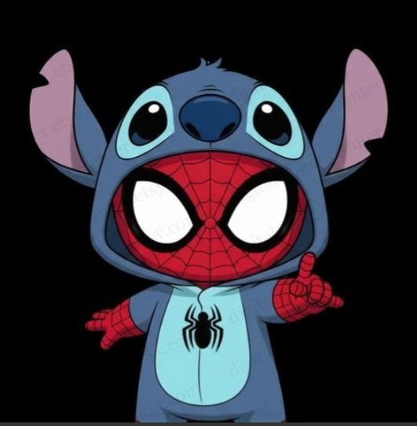

  

<h1 align="center">Hi 👋, I'm Krishna Sanghavi</h1>

<h3 align="center">Frontend UI/UX designer</h3>

  

The one who builts for people and for production

<h2 align="center">🚀 About Me</h2>

**Krishna Sanghavi**, here — I am a student at DJSCE, Head of Events of DJS TC and the a frontened developer aiming to be a fullstack developer.

I am learning Competitive Programming and CTF.

Currently, I'm learning **frontend and backend designing**, while sharpening my skills in **event management**.

My goal is simple: rework on myself everyday till I am not perfect.

 

<h2 align="center">🤝 Connect</h2>

  
  &nbsp;&nbsp;&nbsp;
  
  &nbsp;&nbsp;&nbsp;
  

<h2 align="center">💻 Tech Stack</h2>

  

<h2 align="center">📊 GitHub Stats</h2>

  

<h2 align="center">📈 Activity Graph</h2>

  

<h2 align="center">🧊 3D Contribution Graph</h2>

  <picture>
    <source media="(prefers-color-scheme: dark)" srcset="https://raw.githubusercontent.com/YOUR_USERNAME/YOUR_USERNAME/output/github-contribution-grid-snake.svg">
    <source media="(prefers-color-scheme: light)" srcset="https://raw.githubusercontent.com/YOUR_USERNAME/YOUR_USERNAME/output/profile-3d-contrib/profile-night-rainbow.svg">
    
  </picture>

<h2 align="center">⌘ Philosophy</h2>

  

